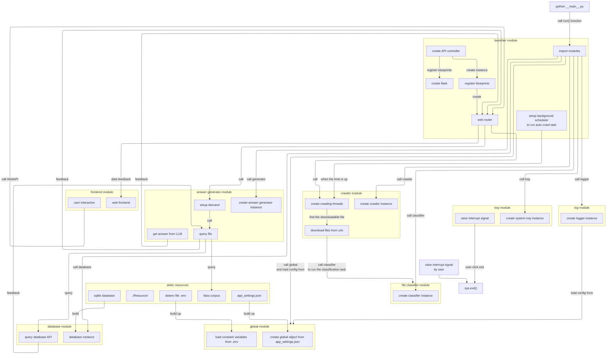

# Project Flowchart

```mermaid
---
config:
  layout: elk
---
flowchart TB
 subgraph launcher["launcher module"]
        launcher_import_module["import modules"]
        launcher_setup_scheduler["setup background scheduler<br>to run auto crawl task"]
        launcher_register_blueprints["create API controller"]
        controller_instance["register blueprints"]
        router["web router"]
        launcher_create_flask["create flask"]
  end
 subgraph global["global module"]
        global_dotenv["load constant variables from .env"]
        global_object["create global object from app_settings.json"]
  end
 subgraph logger["log module"]
        global_logger["create logger instance"]
  end
 subgraph tray["tray module"]
        create_tray_instance["create system tray instance"]
        raise_interrupt_signal["raise interrupt signal"]
  end
 subgraph crawler["crawler module"]
        create_crawler_instance["create crawler instance"]
        start_crawling["create crawling threads"]
        file_downloading["download files from urls"]
  end
  subgraph database["database module"]
    create_database_instance["database instance"]
    database_query_api["query database API"]
  end
 subgraph classifier["file classifier module"]
        create_classifier_instance["create classifier instance"]
  end
 subgraph generator["answer generator module"]
        create_answer_generator["create answer generator instance"]
        setup_demand["setup demand"]
        query_file["query file"]
        get_llm_answer["get answer from LLM"]
  end
 subgraph frontend["frontend module"]
        index_html["web frontend"]
        user_interactive["user interactive"]
  end
 subgraph resources["static resources"]
        sqlite_database["sqlite database"]
        faiss_corpus["faiss corpus"]
        dotenv_file["dotenv file .env"]
        app_settings_json["app_settings.json"]
        file_storage_dir["./Resource/"]
  end
    entry["python __main__.py"] -- call run() function --> launcher_import_module
    launcher_import_module -- call global <br> and load config from --> global
    dotenv_file--"build up"-->global_dotenv
    launcher_import_module -- call database --> create_database_instance
    sqlite_database --build --> create_database_instance
    app_settings_json--"build up"-->global_object
    launcher_import_module -- call logger --> logger
    launcher_import_module -- call tray --> create_tray_instance
    launcher_import_module -- call crawler --> create_crawler_instance
    launcher_import_module -- call classifier -->create_classifier_instance
    launcher_import_module -- call generator -->create_answer_generator
    raise_interrupt_signal -- user click exit --> sys_exit
    logger -- load config from --> global
    launcher_setup_scheduler -- when the time is up --> start_crawling
    launcher_register_blueprints -- register blueprints --> launcher_create_flask
    launcher_register_blueprints -- create instance --> controller_instance
    controller_instance -- create --> router
    start_crawling -- find the downloadable file --> file_downloading
    file_downloading -- call classifier<br> to run the classification task --> classifier
    user_interactive -- call WebAPI --> router
    router -- data feedback --> index_html
    router -- call --> start_crawling & setup_demand
    setup_demand --call-->query_file
    query_file--"query"-->database_query_api & faiss_corpus
    database_query_api--feedback-->query_file
    query_file -- feedback -->router
    get_llm_answer --feedback-->router
    terminal["raise interrupt signal <br> by user"] --> sys_exit["sys.exit()"]
```
