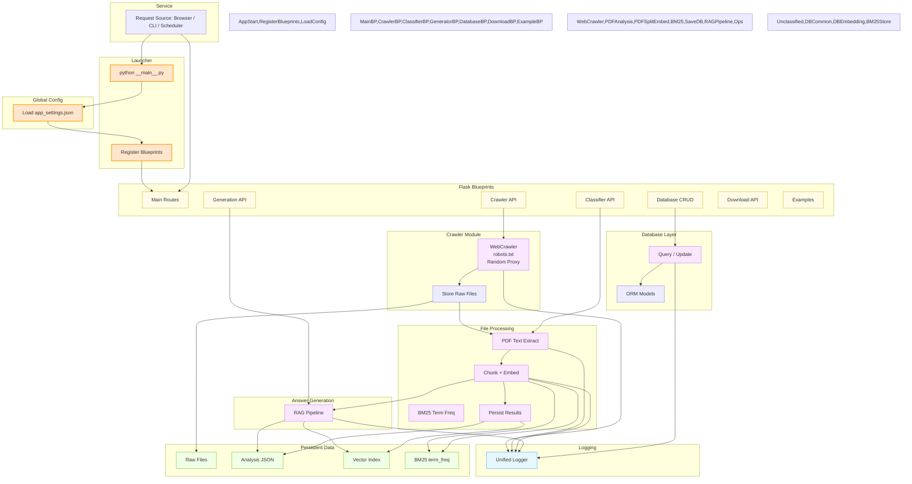

# STAT7008A: Programming for Data Science (Fall 2025) - Final Group Project - Group 19

## Members

- Zhang Yinan
- PANG Boyang
- Li Xu
- Nie Chunjing
- WANG Qihao
- Chen Zhuo

## Initialized the Virtual Environment

[Virtual Environment List(.txt)](./requirements.txt)

```powershell
# run venv module
python -m venv .venv
# active venv
.venv/Scripts/activate
# install requirements form requirements.txt
pip install -r requirements.txt
# for MacOS user, you may need to run requirements_macos.txt instead.
# pip install -r requirements_macos.txt
```

## Setup the Config Files

- Enter the [program folder](./paper_ai_agent)
- Check and setup the [.env(.env)](./paper_ai_agent/.env) environment config file.
  - You may need to create one from [.env.example(.env.example)](./paper_ai_agent/.env.example) dotenv template file.
  - Setup your APIKEY of Deepseek in .env. Otherwise, you may not run this program.
- Check and setup the [app_settings(.json)](./paper_ai_agent/app_settings.json) application settings json file.
  - Generally, you do not need to modify it.
- Check and setup the [app_database(.db)](./paper_ai_agent/DB/app_database.db) sqlite database file.

## Run the Project

```powershell
# set the "paper_ai_agent" as the root
cd ./paper_ai_agent
# run the launcher script
python __main__.py
```

## Flowchart and Module Functions Description



## Reference

[Project Guide(.pdf)](./STAT7008a_project.pdf)
