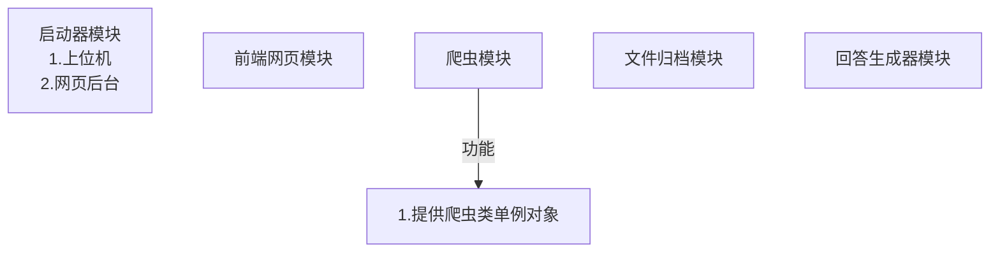

# 需求表

## 命名规范

```python
GLOBAL_VALUE:int = 100
'''全局变量采用全字母大写格式'''
local_var:int = 0
'''局部变量采用蛇形命名'''
class MyClass:
  '''类命名时，采用大驼峰命名格式'''

  def __init(self)__:
    pass
  def _private_method(self):
    '''私有方法使用“_+蛇形命名”'''
    pass
  def __strong_private_method(self):
    '''禁止外部访问的方法。使用“__+蛇形命名”'''
    pass
  def public_method(self):
    '''公开方法使用蛇形命名'''
    pass
  def example_method(initial_value:int = 0,*,factor:float=1.0)->int:
    '''公开方法的参数需要做到词义清晰，尽量避免用法和参数词义对不上。

        参数：
          initial_value:一个初始数值，用于模拟用户输入。
          factor: 算法随机因子数,仅支持关键词用法输入。

        返回：
          result: 经过算法计算后的输出值

        异常:
          ...
    '''
    result:int = algorithm(initial_value,factor)
    return result
```

- 尽量避免拼音命名和首字母缩写，尤其是复杂功能方法内部以及参数命名时。

## 网页爬虫 daily_crawling

- [ ] 1. 初次运行 daily_crawling.exe 软件时，将软件运行写入注册表，之后每次电脑启动时，自动运行本程序。（可选）
- [ ] 2. 程序启动后自动后台运行，在菜单栏中提供用户退出程序的选项。（可选）
- [ ] 3. 读取配置文件表 crawling_config.json（必须）：
  - [ ] 1. 每日爬虫的时间点 （e.g. `trigger_time:"8:00AM,UTC+08:00"`）（必须）
  - [ ] 2. 爬虫网站清单 （e.g. `crawling_source_list:["arxiv.org/catchup/cs.CV/2025-09-30?abs=True","https://scholar.google.com/?hl=zh-CN"...]`）（可选）
  - [ ] 3. 禁止访问的网站清单（可选）
  - [ ] 4. 爬虫关键词设置（e.g. `crawling_keywords:["[Pp]aper","[Ee]ssay"...]`）（可选）
  - [ ] 5. 爬虫文件类型设置（e.g. `file_type:[".pdf",".txt",".jpg",".png"...]`）（可选）
  - [ ] 6. 爬虫文件时效性设置，单位：天（e.g. `timeliness:365`）（可选）
- [ ] 4. 根据配置表内容执行爬虫任务（必须）
  - [ ] 1. 文件类型分析功能（必须）
    - [ ] 1.爬取.pdf 文件（必须）
    - [ ] 2.根据文件类型爬取（可选）
    - [ ] 3.根据关键词爬取（可选）
    - [ ] 4.根据文件时效性爬取（可选）
  - [ ] 2. 访问并爬取网站功能（必须）
    - [ ] 1.[arXiv website](https://arxiv.org/catchup/cs.CV/2025-09-30?abs=True)（必须）
    - [ ] 2. 根据爬取清单访问并爬取网页（可选）
    - [ ] 3. 全网爬取，但避开禁止爬取的网页（可选）
  - [ ] 3. 提供 API 接口，用于前端下发爬虫任务 （e.g. `def start_crawling_task()->bool`）（必须）
  - [ ] 4. 提供 API 接口，用于前端实时数据显示（可选）：
    - [ ] 1.当前正在爬取的网页 （e.g. `def get_current_crawling_web()->str`）（可选）
    - [ ] 2.当前正在爬取的文章 （e.g. `def get_current_crawling_article()->str`）（可选）
    - [ ] 3. 爬取的工作进度 （e.g. `def get_crawling_task_progress()->float`）（可选）
- [ ] 5. 将爬取到的文件存储至根目录下的 Resources 文件夹中的 Unclassified 文件夹中（e.g. `./Resource/Unclassified/MyPdf.pdf`）（必须）
  - [ ] 按照日期和格式分类（e.g. `"./Resource/Unclassified/PDF/2025-10-17_225143/Paper.pdf","./Resource/Unclassified/PNG/2025-10-18_001234/Screenshot.png"...`）（可选）
- [ ] 6. 在根目录 Crawling Log 中生成爬取清单日志（e.g. `./Crawling Log/2025-10-17_225143.log`）（可选）
  - [ ] 日志示例（e.g. `[2025-10-17 22:51:43] FileName:"Paper.pdf" Url:".../Paper.pdf"`）（可选）
- [ ] 7. 运行时异常捕获处理（可选）

## 文档归档智能体 file_classifier

- [ ] 1. 文档解析（必须）
  - [ ] 1. 使用第三方库实现.pdf 文件文本解析 （e.g. PyPDF2/pdfplumber/PyMuPDF）（必须）
    - [ ] 从`./Resource/Unclassified`目录下查找未归档的文档 -> 进行归档任务 -> 将归档后的文档存放于`./Resource/Classified`文件夹中对应的位置，并移除`./Resource/Unclassified`对应的文档。（必须）
  - [ ] 2. 使用第三方库扫描.pdf 文件中的图像信息，并转换成文本 （e.g. 第三方库：pytesseract/ pdf2image）（可选）
- [ ] 2. 文本预处理与特征提取（暂定）
  - [ ] 1. 使用第三方库，对文本进行清洗、词汇分离、去停用词；使用 TF-IDF 算法将文本向量化。将非结构化文本转为机器学习模型可读数值特征 （e.g. 第三方库：nltk/ sklearn）（暂定）
  - [ ] 2. 提取文档关键词和高频词 （top5，重点关注名词和实义动词），生成文档标签 tag (重点关注名词和文章标题)。（e.g. 高频词和关键词`term_frequency:dict[str:int] = {'attention':151,'need':70,'neural network':67,'algorithm':50,'ai':50}`，文档标签 tag `tags:list[str] = ["machine learning","attention mechanism","artificial intelligence"...]`）（必须）
  - [ ] 3. 提取文章描述概要。（暂定）
  - [ ] 4. 将提取出来的文章信息（特征值、高频关键词、标签、概要...）存储到本地数据集（.json/.csv/.xlsx...）中，以支持解答智能体查询相关文档。（必须）
    - [ ] 1.支持百万数量级并发读写，线程安全。（可选）
    - [ ] 2.采用数据库存储读写。（可选）
- [ ] 3. 提供 API 接口，用于前端下发文档处理任务。（e.g. `def start_classify_task()->bool`）（必须）
- [ ] 4. 提供 API 接口，用于前端终止文档处理任务。（e.g. `def stop_classify_task()->bool`）（必须）
- [ ] 5. 提供 API 接口，用于前端获取文档处理任务进度。（e.g. `def get_classify_progress()->float`）（必须）
- [ ] 6. 提供 API 接口，用于前端下发导出分析结果任务，以 excel 格式导出。（e.g. `def export_analysis_to_excel()->bool`）（必须）

## 解答智能体 answer_generator

- [ ] 1. 提供 API 接口，用于处理前端输入用户的提问和需求。（e.g. `def set_demand(user_input:str)->bool`）（必须）
  - [ ] 对用户需求进行分析并分类（必须）
    - [ ] 1. 进行语义分析，提炼用户需求，归类为：1.文件查询 2.问题解答（必须）
    - [ ] 2. 进行相关文件搜索，根据高频词或者文件标签查询（必须）
- [ ] 2. 提供 API 接口用于前端终止当前任务 （e.g. `def stop_current_task()->bool`）（必须）
- [ ] 3. 提供 API 接口用于前端下发重新生成任务指令 （e.g. `def redo_task(user_input:str)->bool`）（必须）
- [ ] 4. 提供 API 接口用于显示当前检索到的文件（e.g. `def get_query_file()->list[str]`） （必须）
- [ ] 5. 提供 API 接口用于显示前 n 个符合检索要求的文件全部信息 （e.g. `def get_qualified_files_info(top_n:int = 5)->list[dict[str,str]]`）(必须)
- [ ] 6. 文件查询功能需求明细（必须）：
  - [ ] 1. 在查询结束后，获取高频词制统计，以及文件与用户需求的相关性百分比。（必须）
    - [ ] 需要设计算法来计算相关性。（必须）
  - [ ] 2. 在查询结束后，获取显示文件的梗概摘要。（必须）
  - [ ] 3. 在查询结束后，获取关键文件字段摘要。（必须）
    - [ ] 对于非文本文件，提取特征信息，并转化成文本描述。（可选）
  - [ ] 4. 提供 API 接口，将相应的查询结果传递给前端 （e.g. `def get_query_task_result()->list[dict[str,str]]`）(必须)
  - [ ] 5. 对于 LLM 问题解答功能，除了需要满足上述需求之外（必须）：
    - [ ] 1. 需要将查询到的文件转化成 LLM 能够解析的文本信息。（必须）
    - [ ] 2. 设置 LLM 提示词，让 LLM 根据查到的文章文本来回答问题。（必须）
      - [ ] 1. 提示词中需要设计回答规则，在每个引用文章的字段之后标注对应的引用文章来源。（可选）
      - [ ] 2. 设计提示词，如果 LLM 不能从指定文本中获取回答问题的信息，则回复无有效参考，减少幻觉的触发概率。（可选）
    - [ ] 3. 设置 token 上限，自定义 api-key 等用户自定义参数。（可选）
      - [ ] 提供 API 接口，让用户通过前端设置数据。（可选）
  - [ ] 6. 提供 API 接口，将 LLM 回答的结果传递给前端 （e.g. `def get_LLM_reply()->Any`）(必须)
    - [ ] 使用 async 语法，实现逐个字符输出效果。（可选）

## 主程序启动器 launcher

- [ ] 1.将网页爬虫、文档归档智能体以及解答智能体串联。（必须）
  - [ ] 使用多线程让每个模块独立运行。（可选）
- [ ] 2. 构建 WebApi Router，实现前端与后端数据中转功能：（e.g. 第三方库 Flask）（必须）
  - [ ] 1. 网页爬虫路由设计：（必须）
    - [ ] 1. 用于前端下发开始爬虫任务 （e.g. `app.route('/crawler/start_crawling_task',method = ['POST'])`）（必须）
    - [ ] 2. 用于前端下发停止爬虫任务 （e.g. `app.route('/crawler/stop_crawling_task',method = ['POST'])`）（必须）
    - [ ] 3. 用于前端获取当前爬取网页信息 （e.g. `app.route('/crawler/current_crawling_web',method = ['GET'])`）（必须）
    - [ ] 4. 用于前端获取当前爬取文件信息 （e.g. `app.route('/crawler/current_crawling_file',method = ['GET'])`）（必须）
    - [ ] 5. 用于前端获取当前爬取进度 （e.g. `app.route('/crawler/current_crawling_progress',method = ['GET'])`）（必须）
  - [ ] 2. 文档解析路由设计：（必须）
    - [ ] 1. 用于前端下发文件分类任务（e.g. `app.route('/classifier/start_classify_task',method = ['POST'])`）（必须）
    - [ ] 2. 用于前端停止文件分类任务 （e.g. `app.route('/classifier/stop_classify_task',method = ['POST'])`）（必须）
    - [ ] 3. 用于前端获取当前分类任务进度 （e.g. `app.route('/classifier/get_classify_progress',method = ['GET'])`）（必须）
    - [ ] 4. 用于前端导出文档分析结果（e.g. `app.route('/classifier/export_analysis_to_excel',method = ['POST'])`）（必须）
  - [ ] 3. 解答智能体路由设计：（必须）
    - [ ] 1. 用于前端传递用户输入 （e.g. `app.route('/generator/set_demand',method = ['POST'])`）（必须）
    - [ ] 2. 用于前端获取检索到的文件（e.g. `app.route('/generator/get_query_file',method = ['GET'])`）（必须）
    - [ ] 3. 用于前端获取前 n 个符合条件的文件 （e.g. `app.route('/generator/get_qualified_files_info/<int:top_n>',method = ['GET'])`）（必须）
    - [ ] 4. 用于前端获取查询检索结果 （e.g. `app.route('/generator/get_query_task_result',method = ['GET'])`）（必须）
    - [ ] 5. 用于前端获取 LLM 的回答结果 （e.g. `app.route('/generator/get_LLM_reply',method = ['GET'])`）（必须）

## Web 前端 index.html

- [ ] 1. 可交互网页前端（必须）
  - [x] 1. 实现用户输入对话框 （必须）
  - [x] 2. 实现用户发送按钮 （必须）
  - [x] 3. 实现用户手动终止当前任务按钮 （必须）
  - [ ] 4. 实现用户将归档文件导出到 excel 的按钮。（必须）
- [ ] 2. 在文件检索结束以后，允许用户查阅文件：
  - [ ] 1. 对于每个文件，显示检索相关度。（必须）
  - [ ] 2. 对于每个文件，实现勾选复选框，允许用户选择哪些文件作为参考资料。（必须）
  - [ ] 3. 鼠标悬停在每个文件上时，显示文件描述。（可选）
  - [ ] 4. 鼠标悬停在每个文件上时，显示文件与需求相关联的字段/文本。（可选）
- [ ] 3. 对于 LLM 回答处理：（必须）
  - [ ] 1. 以 markdown 语法渲染在页面的话框内。（必须）
  - [ ] 2. 处理特殊文本标记，以便用户跳转对应的文章和内容。（e.g. `根据论文显示，实验数据呈现上升趋势。...[1:{17},3:{46,154}]` 表示第 1 篇文章第 17 段和第 3 篇文章第 46 段和 154 段提供了相应的证据。）（可选）
- [ ] 4. 根据 [launcher](#主程序启动器-launcher) 中提供的 WebAPI Url 实现对应的接口功能。（必须）


